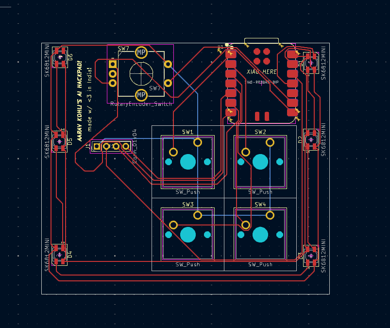
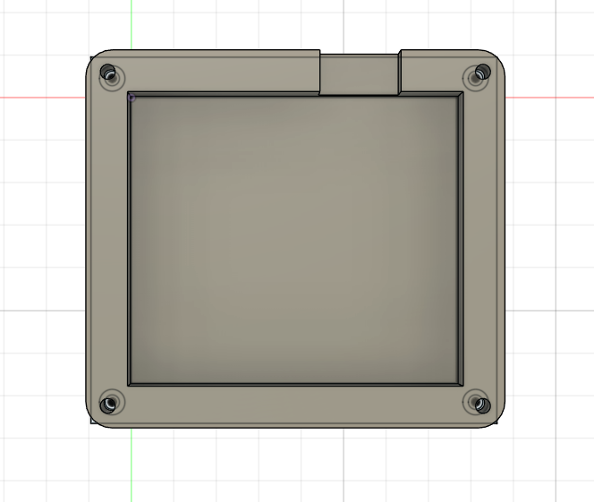
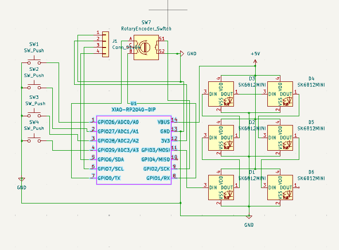
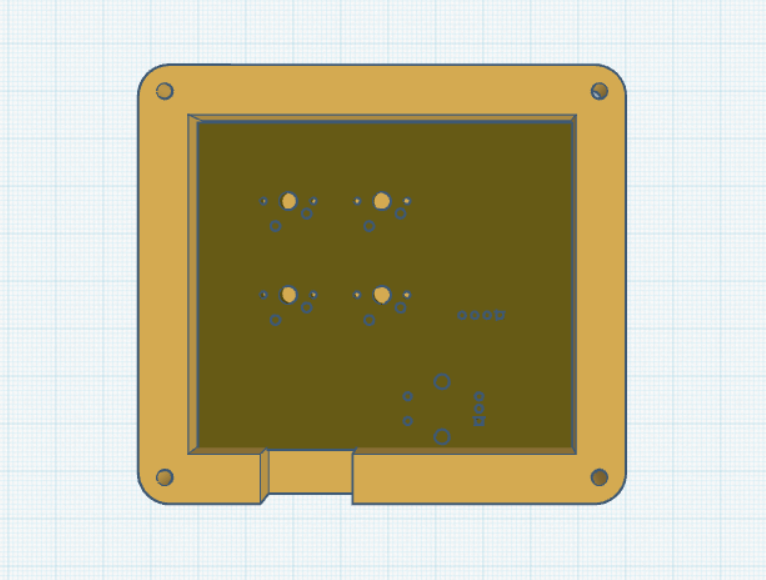

# Aarav Kohli AI HackPad

This is my open heart AI Hackpad!

Inspiration
I wanted to create a macropad that allowed me to open AI applications I use daily. I created a macropad using 4 switches, 1 rp2040, and 6 leds and 1 rotary encoder. I also love open-heart automatic watches as they show whats really inside, so I went the bold choice of not having a top plate on my keyboard.

Challenges
This was my first time ever using KiCad or Fusion360, I spent a solid day learning these programmes and their fundamentals. I then worked on it and as i kept encountering issues while routing or while exporting, google helped me out along with the KiKad discord community. It was truly a beautiful experience and has helped me dwell deeper into the world of PCB design and CAD design.

Specifications
BOM:

4x Cherry MX Switches
6x SK6812 MINI Leds
1x XIAO RP2040
4x Blank DSA Keycaps
1x Rotary Encoder
Others:

